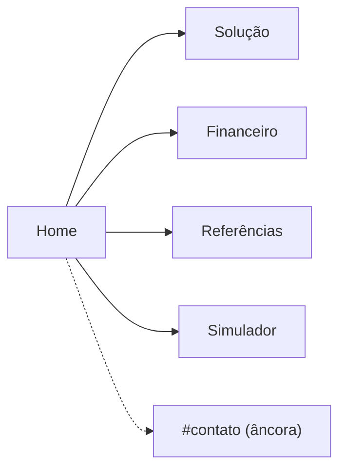

# Kessler Shield

```
  ██╗  ██╗███████╗███████╗███████╗██╗     ███████╗██████╗
  ██║ ██╔╝██╔════╝██╔════╝██╔════╝██║     ██╔════╝██╔══██╗
  █████╔╝ █████╗  ███████╗███████╗██║     █████╗  ██████╔╝
  ██╔═██╗ ██╔══╝  ╚════██║╚════██║██║     ██╔══╝  ██╔══██╗
  ██║  ██╗███████╗███████║███████║███████╗███████╗██║  ██║
  ╚═╝  ╚═╝╚══════╝╚══════╝╚══════╝╚══════╝╚══════╝╚═╝  ╚═╝
            S H I E L D
```

**Active Debris Removal System — Poly-Catch System**  
FIAP Global Solution 2025

---

O projeto nasce de um problema real que a maioria das pessoas desconhece: há mais de 40 mil objetos rastreados em órbita, e mais de 1,2 milhão de fragmentos menores que 1 cm que não conseguimos nem monitorar. Esses detritos viajam a cerca de 10 km/s. Uma colisão gera novos fragmentos; esses fragmentos geram mais colisões. Donald Kessler descreveu esse efeito cascata em 1978 e se não fizermos nada, algumas órbitas vão se tornar inacessíveis dentro de algumas décadas. Satélites de comunicação, GPS, previsão do tempo — tudo isso vive nessas órbitas.

A proposta do Kessler Shield é capturar esses detritos com um polímero expansível (espuma). O satélite se aproxima do detrito, sincroniza o movimento orbital, dispara a espuma que envolve o objeto suavemente, e a área superficial aumentada gera atrito com a atmosfera residual até que o conjunto reentra e se incinera. Quatro etapas, sem fragmentação adicional.

Este repositório é o site institucional que apresenta esse projeto — o problema, a solução, a viabilidade financeira, as referências científicas que embasam tudo, e um simulador interativo da Síndrome de Kessler.

---

## Páginas

```
/              Home — apresentação completa em seis seções
/solucao       As quatro etapas de captura com ilustrações
/financeiro    Modelos de receita e projeções financeiras
/referencias   Base científica com busca e filtros
/simulador     Simulador 3D da dinâmica orbital
```

O fluxo pensado para quem chega pela primeira vez é linear: a Home já conta a história inteira (problema, solução, pitch financeiro, uma amostra das referências, contato e equipe), então as outras páginas são o aprofundamento de cada bloco.



**Home** tem seis seções numeradas. A primeira é o hero com o conceito central. Depois vem uma chamada pro simulador, o problema com os números da ESA/NASA, um resumo dos quatro passos da solução, os três modelos de receita, e uma prévia das referências. No final ficam o formulário de contato/newsletter e a apresentação da equipe.

**Solução** detalha cada etapa da missão de captura com imagens e texto explicativo. Cada passo tem um nome: A Dança Sincronizada, O Efeito Teia de Aranha, O Paraquedas Invisível, A Lixeira Incineradora.

**Financeiro** apresenta três fontes de receita — B2B (mercado de seguros de US$580M), B2G (contratos ADR-as-a-Service com governos), e ESG (tokenização de Créditos Orbitais) — com simulação financeira interativa e breakdown de custos.

**Referências** é uma base pesquisável com 17 fontes científicas e institucionais (ESA, NASA, SpaceX, periódicos de engenharia aeroespacial). Dá pra filtrar por categoria e pesquisar por texto.

**Simulador** é um painel 3D em tempo real que modela a dinâmica da Síndrome de Kessler — satélites ativos, crescimento de detritos, colisões por ano, impacto financeiro. O globo renderiza as órbitas e a intensidade do aura aumenta conforme o sistema se deteriora. As equações diferenciais por trás da simulação ficam disponíveis em LaTeX dentro do painel.

---

## Stack

React 19 + Vite 8. Roteamento com React Router DOM v7. Animações com Framer Motion. Nenhuma biblioteca de UI — tudo CSS puro com variáveis de design e BEM. Ícones via Lucide e React Icons. Contadores animados com React CountUp. LaTeX no simulador com KaTeX. Bootstrap só para classes utilitárias de grid.

Acessibilidade tem VLibras (língua de sinais brasileira), UserWay, leitor de áudio, e ARIA em toda a estrutura.

Fontes: Orbitron para display, Space Grotesk para corpo.

---

## Rodar localmente

```bash
npm install
npm run dev
```

Vite sobe em `http://localhost:5173` por padrão. Para build de produção:

```bash
npm run build
npm run preview
```

Node 18+ recomendado. Sem variáveis de ambiente necessárias — o projeto é inteiramente client-side.

---

## Estrutura do projeto

```
src/
├── pages/
│   ├── Home.jsx
│   ├── Solucao.jsx
│   ├── Financeiro.jsx
│   ├── Referencias.jsx
│   └── Simulador/
├── components/
│   ├── Navbar.jsx
│   ├── Footer.jsx
│   ├── Starfield.jsx        # fundo estrelado em canvas
│   ├── Reveal.jsx           # animação de entrada ao rolar
│   ├── ui.jsx               # Badge, SectionLabel, PageHero
│   ├── context/
│   │   └── LanguageContext.jsx   # i18n PT/EN
│   └── home/                # seções da Home como componentes separados
└── data/
    ├── references.js        # 17 referências científicas
    ├── mercados.js
    └── custos.js
```

CSS co-locado com cada componente. `index.css` guarda tokens e utilitários globais.

---

## Equipe

Natália Lugão — Front-end & identidade visual  
Sophia Coelho — Front-end & acessibilidade  
Gabriel Soares — Front-end & design system  
Jefferson Gomes — Front-end & UI/UX  
André Melo — Pitch & desenvolvimento criativo
